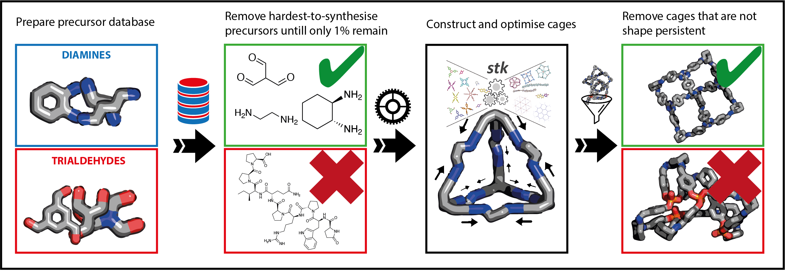

Modelling Chemist Intuition for the Synthetic Accessibility of Porous Organic Cages
===================================================================================

Description
-----------

This repository contains code used to reproduce the paper ().
The MPScore model classifies a molecule as 'easy-to-synthesise' (1) or 'difficult-to-synthesise' (0), based on training data obtained
from three expert chemists.
The model returns a probability that a molecule belong to the 'difficult-to-synthesise' class, which can be interpreted as a continuous score,
such that a lower score indicates a molecule is easier-to-synthesise.

Summary
-------

In this work, we use high-throughput screening to discover if it possible to form shape-persistent cages from the easiest-to-synthesise (as shown in the above figure).
We screen for easiest-to-synthesise precursors, followed by constructing cages from those precursors, with the aim of identifying cages that remain shape persistent.

Requirements
------------

`scikit-learn` (0.24.1) - Required to re-train model and run predictions

`rdkit` (2021.09.4) - Required to perform fingerprinting.

Contents
-----------

The repository is organised in the following way:
- `data`
    -  `training_database.csv`: Contains chemist scoring data in the `chemist_score` column, in addition to pre-calculated synthetic accessibility scores using the SAScore and SCScore. 1 corresponds to a molecule that is easy-to-synthesise and a 0 corresponds to one which is difficult-to-synthesise.
    - `chenist_scores.json`: Contains chemist scoring in `.JSON` format. Molecules are in InChi format, in addition the chemist scores in the `synthesisable` column. 1 corresponds to a molecule that is easy-to-synthesise and a 0 corresponds to one which is difficult-to-synthesise.
    - `chemist_data`: Folder containing all classification data collected from chemists.
        - `chemist_name_.csv/.json`: Contains all the chemist scores obtained from the website.
    - `training_mols.json`: Contains all molecules provided to chemists in InChi format, in addition to 3D coordinates generated by the ETKDG algorithm.
    - `training_mols.csv`: Contains the SMILES strings for all the molecules in `training_mols.json`.
    - `reaxys_database.csv`: Contains diamines and trialdehydes used to build cages in the high-throughput screening part of the paper.
    Database contains molecules as SMILES stirngs, in addition to their functional group, and calculated synthetic accessibility scores (SAScore, SCScore)
    Precursors were screened for their synthetic accessibility, before building a cage using `stk` and undergoing a fast geometry optimisation.
- `scripts`
    - `mpscore.py`: Contains code to reproduce the cross-validation procedure performed in the paper, in addition to training the final MPScore model.
    The code to reproduce the precision recall curve (Figure 5b in the main paper) is also present here.
    For end users wanting to test the MPScore, the function `get_score_from_smiles` is available.
    This will return a `float` of the synthetic difficulty of a molecule.
    - `cage_optimise.py`: Contains code to perform the optimisation procedure used in the paper, which makes extensive use of the MacroModel software.
    To replicate this procedure, the user must have MacroModel installed, in addition to the identical version of `stk` used in the paper.
    The provided `env.yml` file will install all dependencies into a new Anaconda environment named `mpscore`, including the version of `stk` used for this work.
    Generally, this code takes input of the cage precursors from a `.csv` file of the form diamine SMILES, trialdehyde SMILES and populates a MongoDB database with tbe cage in a dictionary format.
    - `property_calculate.py`: Contains code to perform property calculations on optimised cages.
    This makes extensive use of `RDKit` and `pyWindow` to perform optimisations, which can be easily installed using the given `env.yml` file. This file makes extensive use of `rdkit_tools.py` for useful functions.
    - `hyperparam_opt.py`: Contains code to perform hyperparameter optimisation using a randomised grid-search approach.
    - `hyperparameters`: Contains hyperparameter files and scores for the hyperparameter optimisation process.

- `notebooks`
    - `database_analysis.ipynb`: Contains code to reproduce Figure 4 and Figure 6, which are based on the synthetic difficulty score distributions of the training dataset, and the dataset of precursors used for cage screening.
    In this notebook synthetic difficulty scores are calculated and plotted.
    Additionally, reproduces Figure 7 from the main text, which shows the distributions of cavity sizes for shape persistent cages.
    In this notebook cages are loaded directly from JSON and filtered for their properties.
    To fully utilise this notebook, additional files corresponding to the optimised cages for this work are required.
    These files are accessible [here](https://doi.org/10.14469/hpc/8395).
    Optimised cages and their properties are written to a database in `cage_optimise.py` and `property_calculate.py`.

- `models`
    - `mpscore_calibrated.joblib`: The stored MPScore model. Can be loaded using the `joblib` Python library.

- `site`
    Contains the code for the website provided to experimental chemists to label molecules as easy- and difficult-to-synthesise.
